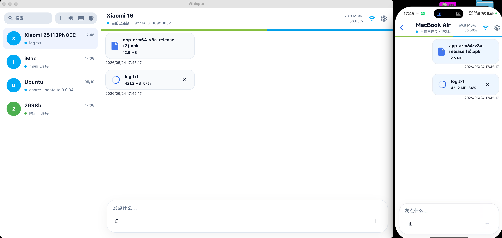
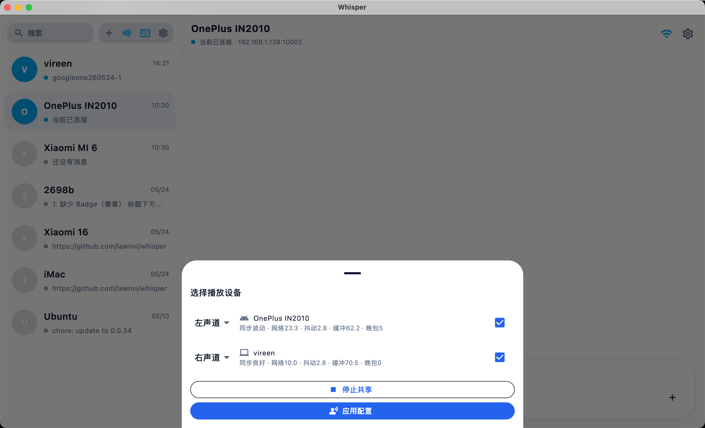
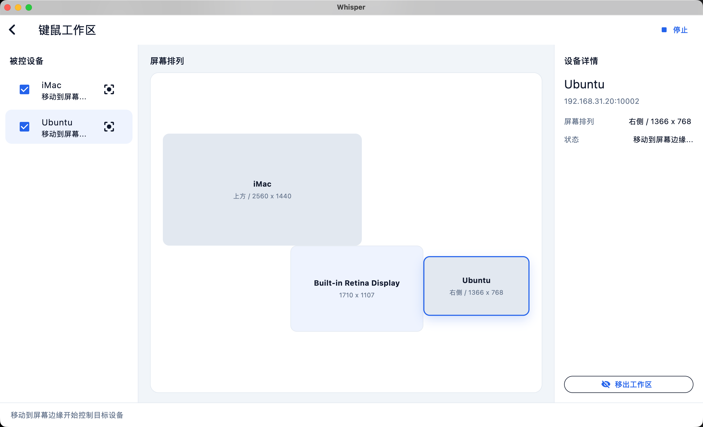

# Whisper


[中文](./README.md)

> A LAN collaboration app for personal devices. Whisper creates an end-to-end encrypted local connection between your computers and phones to send text, files, notifications, audio, and keyboard/mouse input.
> This project is not related to OpenAI's Whisper speech recognition model.

## Download

[Download the latest release](https://github.com/lawnvi/whisper/releases/latest)

## What It Solves

Whisper is built for a small but frequent problem: your computers, phones, and spare devices are right next to you, yet moving a bit of text, a file, or audio still often means using a chat app, cloud drive, or cable.

It is not a cloud drive or a public remote desktop tool. Whisper works inside a trusted LAN by default, and devices establish explicit peer-to-peer connections. It is useful for quick transfers between your own devices, receiving Android notifications, sharing desktop system audio, or moving one keyboard and mouse across desktop machines.

## Screenshots

### File Transfer



| Audio Sharing | Keyboard/Mouse Sharing |
| --- | --- |
|  |  |

## Features

- **End-to-end encryption**: paired text, files, clipboard data, notifications, audio, and keyboard/mouse control use encrypted channels with visible identity and trust state.
- **Direct multi-device connections**: one device can connect to multiple computers or phones, with visible and explicit connection state.
- **Chat-style transfer**: send text, clipboard content, and files in conversations; view images full screen, play audio inline, open video in the system player, and select multiple messages for deletion.
- **System quick send**: use the Android share sheet, desktop context menus, or a global hotkey without opening a conversation first. Desktop drafts can wait for a trusted device to reconnect; unsent Android system shares are discarded when the app restarts.
- **QR pairing and diagnostics**: pairing codes bind the LAN endpoint to the device identity, while failures identify Wi-Fi, address, service, firewall, identity, or version problems.
- **Transfer assistant**: send folders, search message text, save favorite snippets, and optionally enable clipboard auto-sync.
- **Streaming verification and resume**: calculate SHA-256 while receiving, normally avoiding a second full-file read at completion, and resume from the last acknowledged offset after a disconnect.
- **System audio sharing**: stream system audio from one desktop device to one or more playback devices, with basic speaker groups and channel roles.
- **Keyboard and mouse sharing**: share one keyboard and mouse across trusted desktop devices, switching targets through screen layout and edge crossing.
- **Desktop experience**: tray integration, launch at startup, close to tray, reveal files in the system file manager, drag files out from desktop messages, light/dark themes, and multilingual UI.

## Recent Updates

- Control traffic and large-file payloads now share the same end-to-end encrypted session, with trusted-device state visible in the UI.
- QR pairing now stays in an in-place dialog, carries both the LAN endpoint and device identity, and requires no extra password; first-time pairing still asks both devices to confirm the same code.
- Image, video, and audio messages use dedicated media cards; images open full screen, audio plays inline, video opens in the system player, and transfer states update in place.
- Android combines LAN listening, file transfer, and audio playback into one foreground notification and clears the receiving state when a transfer completes.
- Long-press any message to enter multi-select mode, select all, or batch-delete chat records; local files are kept by default.

## Connection

Whisper first tries LAN discovery. When two devices are on the same network and both have Whisper open, they should usually appear in each other's device list. Select a discovered device, then confirm the connection request on the receiving side.

If discovery is unavailable, open the QR pairing dialog and scan the code shown by the other device, or enter its LAN IP address and service port manually. The QR code carries both the LAN endpoint and device identity, so there is no extra password to enter. The default service port is `10002`, and it can be changed in Settings under "Server Port"; first-time pairing still requires both devices to verify and confirm the same pairing code.

Linux discovery depends on Avahi. If the network blocks mDNS/Bonjour, manual IP connection is usually more reliable.

## Developer Quick Start

### 1. Prepare the Environment

Install Flutter stable, and make sure the Flutter SDK satisfies Dart `>=3.11.0 <4.0.0`.

```bash
flutter doctor
```

Prepare the toolchain for your target platform:

- Android: Android Studio / Android SDK
- macOS / iOS: Xcode
- Windows: Visual Studio C++ toolchain
- Linux: Flutter Linux desktop dependencies, Avahi, PulseAudio or PipeWire Pulse, GStreamer, libsecret/keybinder/jsoncpp, and an available system keyring

### 2. Install Dependencies and Run

```bash
flutter pub get
flutter run
```

For local macOS debugging, the repository script is recommended. It builds, signs, and launches the debug app:

```bash
sh script/build_and_run.sh
```

### 3. Verify

```bash
flutter analyze
flutter test
```

### 4. Package and Regenerate Code

Package a macOS DMG:

```bash
sh script/build_and_run.sh package-macos
```

Regenerate code after database or localization changes:

```bash
dart run build_runner build --delete-conflicting-outputs
flutter gen-l10n
```

## Usage

### Send Text or Files

Open a conversation with a connected device, type text directly, or use the attachment button to select files. Images open in a full-screen viewer, audio plays inline, and video or other files open through an available system app. Long-press a message and choose multi-select to batch-delete chat records. On desktop, received files can also be revealed in the system file manager or dragged out of a message.

On Android, choose Whisper directly from the system share sheet. On desktop, use the file context-menu entry or press `Cmd+Option+V` on macOS and `Ctrl+Alt+V` on Windows/Linux to quick-send the current clipboard content.

### Share System Audio

On desktop, open audio sharing from the device tools area and choose one or more connected devices that support audio playback. Multi-device playback supports basic synchronization and channel roles, but it is not a professional audio system.

### Share Keyboard and Mouse

On desktop, open the keyboard/mouse sharing workspace and arrange the local and target screens. Once enabled, the pointer crosses from the configured screen edge to the target device, and keyboard input follows the active target.

### Listen to Android Notifications

After granting notification listener permission on Android, choose which apps to listen to. Whisper processes notification content according to your selection, which is useful for short messages such as verification codes.

## Platform Status

| Platform | Status |
| --- | --- |
| Android | Primary mobile platform, with system sharing, QR pairing, media previews, one unified foreground notification, notification listening, and audio playback. |
| macOS | Primary desktop validation platform, with system services and global quick send, tray support, file drag-out, audio sharing, keyboard/mouse sharing, and packaging scripts. |
| Windows | Desktop target with native integration for windows, single-instance behavior, audio, and keyboard/mouse sharing. |
| Linux | Desktop target. Discovery depends on Avahi, system audio sharing uses PulseAudio or PipeWire Pulse, message audio playback uses GStreamer, and keyboard/mouse sharing currently focuses on X11. |
| iOS | Flutter runner is kept, but capabilities are limited by the system and not fully tested. |

## Boundaries and Security

- Paired application data uses end-to-end encryption based on X25519 session keys and XChaCha20-Poly1305. LAN discovery and connection metadata remain visible, local databases and staged files are not encrypted at rest, and the implementation has not received an independent cryptographic audit.
- Whisper does not provide public relays, hub forwarding, or transitive trust.
- Files, audio, and keyboard/mouse input all require connection and capability negotiation; they are not designed as silent background control paths.
- Keyboard/mouse sharing is for nearby personal devices, not unattended remote control.
- Whisper prioritizes direct, controllable, and recoverable LAN workflows. It is not meant to replace professional sync, remote control, or MDM systems.

## What It Is Not

- **Not a cloud drive**: Whisper is not built for public-network sync or long-term multi-device storage. Its core is immediate nearby transfer.
- **Not a chat app**: conversations are just the interaction shell. The goal is moving files, notifications, audio, and input between devices.
- **Not remote desktop**: keyboard/mouse sharing only transfers input. It does not stream the screen and is not intended for unattended access.
- **Not a professional audio system**: audio groups provide usable multi-device playback and channel roles, but do not promise professional phase synchronization.

## License

[MIT](./LICENSE)
