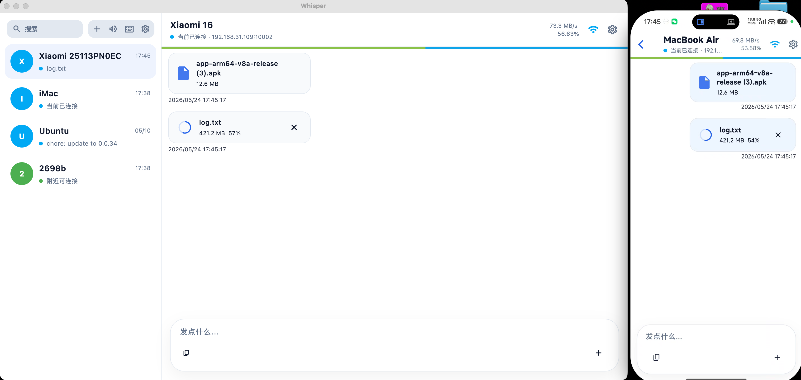
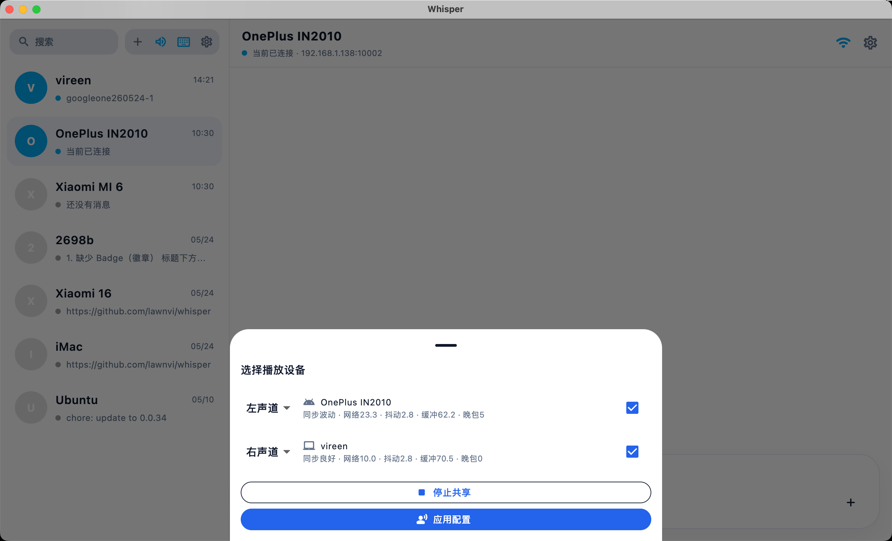
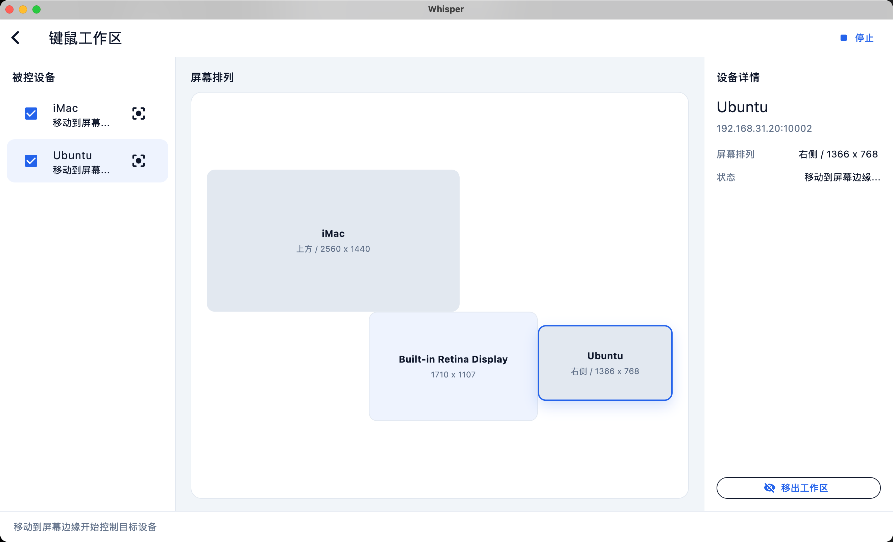

# Whisper


[中文](./README.md)

> A LAN collaboration app for personal devices. Whisper uses a paired, encrypted local connection between your computers and phones to send text, files, notifications, audio, and keyboard/mouse input.
> This project is not related to OpenAI's Whisper speech recognition model.

> Android 10 and later do not allow background apps to read new clipboard content copied in another app. Whisper's Android foreground service keeps the LAN connection alive but cannot bypass this platform restriction; copied text is synchronized after Whisper returns to the foreground.

## Download

[Download the latest release](https://github.com/lawnvi/whisper/releases/latest) · [View release notes](https://github.com/lawnvi/whisper/releases)

The descriptions below follow the current development branch. Check the release notes for features available in published builds.

## What It Solves

Whisper is built for a small but frequent problem: your computers, phones, and spare devices are right next to you, yet moving a bit of text, a file, or audio still often means using a chat app, cloud drive, or cable.

It is not a cloud drive or a public remote desktop tool. Whisper works inside a trusted LAN by default, and devices establish explicit peer-to-peer connections. It is useful for quick transfers between your own devices, receiving Android notifications, sharing desktop system audio, moving one keyboard and mouse across desktop machines, or using an Android phone to control a computer temporarily.

## Screenshots

### File Transfer



| Audio Sharing | Keyboard/Mouse Sharing |
| --- | --- |
|  |  |

## Features

- **Encrypted transfers**: paired text, files, clipboard data, notifications, audio, and keyboard/mouse control use authenticated encrypted direct channels with visible identity and trust state.
- **Direct multi-device connections**: one device can connect to multiple computers or phones, with visible and explicit connection state.
- **Chat-style transfer**: send text and files in conversations while auto-synced clipboard content stays out of history; view images full screen, play audio inline, and open video in the system player. Single and bulk deletion let you choose whether to keep received files; sent originals are always preserved.
- **System quick send**: use the Android share sheet, desktop context menus, or a global hotkey without opening a conversation first. Desktop drafts can wait for a trusted device to reconnect; unsent Android system shares are discarded when the app restarts.
- **Pairing and diagnostics**: display a QR code, scan with a phone, or enter an IP address and port from one dialog. Pairing codes bind the LAN endpoint to the device identity, while failures identify Wi-Fi, address, service, firewall, identity, or version problems.
- **Chat history search**: search text in the current conversation, expand long messages inline, filter favorites, and copy the full text. A checkmark on the copy button confirms success.
- **Controlled clipboard sync**: auto-sync is off by default. Regular sessions send to the current trusted device, while a multi-device keyboard/mouse workspace syncs its connected members. Desktop apps can watch while Whisper is running, while Android 10 and later can only read new clipboard content when Whisper is in the foreground.
- **Streaming verification and resume**: calculate SHA-256 while receiving, normally avoiding a second full-file read at completion, and resume from the last acknowledged offset after a disconnect.
- **System audio sharing**: stream system audio from one desktop device to one or more playback devices, with basic speaker groups and channel roles.
- **TV casting (DLNA, experimental)**: enable TV casting in desktop Settings to receive playback requests from video apps on the same LAN, using this computer's device name. Whisper pairing is not required. Built-in playback supports pause, seeking, and volume; the setting is off by default and remembers your choice. See the [receiver guide (Chinese)](docs/cast_receiver.md).
- **Keyboard and mouse sharing**: share one keyboard and mouse across multiple trusted desktops, with text, image, and file clipboard content following the workspace.
- **Phone controller**: control macOS, Windows, or Linux X11 from Android using an air mouse, touchpad, portrait virtual keyboard, or short text input. Switch between connected computers from the controller page.
- **Desktop screenshots**: click to select a window or drag to select a region, then confirm to copy the image for pasting into Whisper or another app. Screenshot shortcuts are configurable.
- **Desktop experience**: tray integration, launch at startup, close to tray, reveal files in the system file manager, drag files out from desktop messages, light/dark themes, and multilingual UI.

## Connection

Whisper first tries LAN discovery. When two devices are on the same network and both have Whisper open, they should usually appear in each other's device list. Select a discovered device, then confirm the connection request on the receiving side.

If discovery is unavailable, select the QR icon above the device list to open "Connect device":

- **Phone**: switch between the QR code, scanner, and IP/port tabs to display your code, scan another device, or enter its address. Address drafts survive tab changes, and leaving the scanner tab closes the camera.
- **Desktop**: in a wide window, your QR code stays visible on the left while the right side switches between local connection details and the IP/port form.

The QR code carries both the LAN endpoint and device identity, so there is no extra password to enter. The default service port is `10002`, and it can be changed in Settings under "Server Port"; first-time pairing still requires both devices to verify and confirm the same pairing code.

Linux discovery depends on Avahi. If the network blocks mDNS/Bonjour, manual IP connection is usually more reliable.

## Developer Quick Start

### 1. Prepare the Environment

Use **Flutter 3.44.9 stable** to match the repository's CI and packaging workflows. The Dart constraint is `>=3.11.0 <4.0.0`. Install dependencies using the tracked `pubspec.lock`.

```bash
flutter doctor
```

Prepare the toolchain for your target platform:

- Android: Android Studio / Android SDK
- macOS / iOS: Xcode
- Windows: Visual Studio C++ toolchain
- Linux: Flutter Linux desktop dependencies, Avahi, PulseAudio or PipeWire Pulse, GStreamer, libsecret/keybinder/jsoncpp, and an available system keyring

TV casting uses an in-app player. macOS and Windows builds bundle the playback libraries; Linux builds require `libmpv-dev libepoxy-dev`, with the corresponding libmpv/libepoxy packages needed at runtime. See the [AirPlay / Wi-Fi Direct experiment report (Chinese)](docs/2026-09-17_cast-experiments-report.md) for earlier approaches and findings.

### 2. Install Dependencies and Run

```bash
flutter pub get
flutter run
```

For local macOS debugging, the repository script is recommended. It builds, signs, and launches the debug app:

```bash
./script/build_and_run.sh
```

### 3. Verify

```bash
flutter analyze
flutter test
```

For keyboard/mouse changes, run `./script/test_remote_input_keys.sh`. On macOS, `./script/build_and_run.sh --verify` checks building, signing, and launch.

### 4. Package and Regenerate Code

Package a macOS DMG:

```bash
./script/build_and_run.sh package-macos
```

Regenerate code after database or localization changes:

```bash
dart run build_runner build --delete-conflicting-outputs
flutter gen-l10n
```

## Usage

### Send Text or Files

Open a conversation with a connected device, type text directly, or use the attachment button to select files. Images open in a full-screen viewer, audio plays inline, and video or other files open through an available system app. On desktop, received files can also be revealed in the system file manager or dragged out of a message.

On Android, choose Whisper directly from the system share sheet. On desktop, use the file context-menu entry or press `Cmd+Option+V` on macOS and `Ctrl+Alt+V` on Windows/Linux to quick-send the current clipboard content.

### Search, Favorite, and Delete Messages

Open "Search chat history" from the conversation settings; wide desktop windows also have a direct search button. Search covers text in the current device conversation. Select text, expand long messages, favorite a result, or copy its full content directly in the list. The Favorites filter shows saved text. Automatically synchronized clipboard content stays out of chat history.

Long-press a message on mobile or right-click on desktop to delete it or enter multi-select. Both single and bulk deletion show a confirmation dialog: received local files are deleted by default; select "Keep received files" to remove only the records. Sent source files are always preserved. On desktop, `Esc` exits multi-select; if a deletion dialog is open, it closes the dialog first.

### Automatically Sync the Clipboard

Clipboard auto-sync is off by default. Regular sessions send to the current connected, trusted device; a multi-device keyboard/mouse workspace syncs its connected members, with the most recent copy taking precedence. Synchronized text is not stored in conversation history. Desktop builds can watch text while Whisper remains running. Image and file clipboard sharing is limited to desktop keyboard/mouse workspaces and follows per-file and batch size limits.

Android currently synchronizes text clipboard content only. Under the [Android 10 clipboard privacy restriction](https://developer.android.com/about/versions/10/privacy/changes#clipboard-data), Whisper cannot read content copied in another app while Whisper is in the background. The foreground-service notification only keeps the LAN connection and receiving path alive. Whisper checks the clipboard and sends changes after it returns to the foreground.

### Share System Audio

On desktop, open audio sharing from the device tools area and choose one or more connected devices that support audio playback. Multi-device playback supports basic synchronization and channel roles, but it is not a professional audio system.

### Share Keyboard and Mouse

On desktop, open the keyboard/mouse sharing workspace and arrange the local and target screens. Once enabled, the pointer crosses from the configured screen edge to the target device, and keyboard input follows the active target.

Both the controller and the controlled device can stop sharing. Disconnecting a target releases its input control. Single-device sharing and multi-device workspaces share local input ownership: a controlled device cannot start another controller session at the same time. Stop the current session before switching roles.

Enable clipboard auto-sync to paste across devices. Copy text, images, or files, then paste on the target device. Screenshots can also be pasted into the Whisper composer for review before sending; larger images and files need time to transfer over the LAN.

On macOS, grant the requested permissions, including Accessibility. Linux keyboard/mouse sharing currently requires X11; screenshot support on Wayland does not imply keyboard/mouse sharing support.

### Control a Computer from Android

Update both devices to versions that support the phone controller, connect them on the LAN, and establish mutual trust. The computer must be logged in with Whisper running, and you should be able to see its screen. In the Android conversation with that computer, select "Control computer", then tap the start button in the top bar.

| Action | How it works |
| --- | --- |
| Air mouse | Tap the central area to enable motion, turn your wrist to move the pointer, and tap again to pause. You do not need to hold the screen. |
| Touchpad | Move with one finger, tap to left-click, tap with two fingers to right-click, or slide two fingers to scroll. This mode is used automatically when motion sensors are unavailable. |
| Click and drag | Use the left and right buttons at the bottom. Hold the left button while turning your wrist or moving on the touchpad to drag. |
| Scroll | The scroll area sits between the mouse buttons. Hold it and turn your wrist up or down in air-mouse mode, or slide vertically on it in touchpad mode. |
| Virtual keyboard | The top-bar switch opens a portrait QWERTY keyboard with number/symbol and function/navigation pages. Select modifiers, then a regular key to send a shortcut; modifiers clear afterward. |
| Text input | Use the text field on the keyboard page with the phone's input method, then send the completed text. Failed or unconfirmed submissions retain the draft. |

Direct keys follow the computer's current keyboard layout and input method. Use text input for Chinese, emoji, or multiple lines, up to 4 KiB of UTF-8 per submission. The top-bar settings button provides pointer speed, scroll speed, motion sensitivity, and calibration.

When several computers are connected, tap the computer name at the top to choose a target. Switching stops the current control session; tap start again to control the new target. Only one computer is controlled at a time, and the phone controller shares input ownership with the desktop keyboard/mouse workspace. Leaving the page, backgrounding, locking the phone, or disconnecting stops control and releases held input. Reconnection requires a manual start. The desktop device list marks the controlling phone and provides a stop action.

Android 7.0 (API 24) is the current minimum. Air-mouse mode needs gyroscope and gravity sensors; devices without them can still use the touchpad and keyboard. macOS requires Accessibility permission, and Linux requires X11. This feature does not stream the computer screen, wake the computer, or provide login from a locked screen. The phone controller is not yet implemented for iOS/iPadOS.

### Capture and Paste a Screenshot

Use the desktop screenshot button or the shortcut configured in Settings. Click to select a window or drag to select a region, then confirm to copy the image; press `Esc` to cancel. Capturing does not send the image automatically. Paste into the Whisper composer to preview and send it. Linux availability depends on desktop screenshot services, and the system capture dialog may behave differently.

### Listen to Android Notifications

After granting notification listener permission on Android, choose which apps to listen to. Whisper processes notification content according to your selection, which is useful for short messages such as verification codes.

## Platform Status

| Platform | Status |
| --- | --- |
| Android | Android 7.0 or later. Supports the phone controller, system sharing, QR pairing, media previews, notification listening, audio playback, and foreground text clipboard sync. Android 10 and later cannot read new clipboard content in the background. |
| macOS | Primary desktop validation platform. Receives phone control and supports desktop keyboard/mouse sharing, system services and global quick send, tray support, file drag-out, audio sharing, and packaging scripts. |
| Windows | Receives phone control and supports desktop keyboard/mouse sharing, with native integration for windows, single-instance behavior, and audio. |
| Linux | Receives phone control and supports desktop keyboard/mouse sharing on X11. Discovery depends on Avahi, system audio sharing uses PulseAudio or PipeWire Pulse, and message audio playback uses GStreamer. |
| iOS / iPadOS | Flutter runner is kept, but real-device validation is incomplete. The phone controller is not implemented, and feature parity with Android is not guaranteed. |

## Boundaries and Security

- Authenticated direct sessions use X25519 session keys and XChaCha20-Poly1305 to protect application data. LAN discovery and connection metadata remain visible, local databases and staged files are not encrypted at rest, and the implementation has not received an independent cryptographic audit.
- Whisper does not provide public relays, hub forwarding, or transitive trust.
- Files, audio, and keyboard/mouse input all require connection and capability negotiation; they are not designed as silent background control paths.
- Keyboard/mouse sharing is for nearby personal devices, not unattended remote control.
- Whisper prioritizes direct, controllable, and recoverable LAN workflows. It is not meant to replace professional sync, remote control, or MDM systems.

## What It Is Not

- **Not a cloud drive**: Whisper is not built for public-network sync or long-term multi-device storage. Its core is immediate nearby transfer.
- **Not a chat app**: conversations are just the interaction shell. The goal is moving files, notifications, audio, and input between devices.
- **Not remote desktop**: keyboard/mouse sharing only transfers input. It does not stream the screen and is not intended for unattended access.
- **Not a professional audio system**: audio groups provide usable multi-device playback and channel roles, but do not promise professional phase synchronization.

## License

[MIT](./LICENSE)
